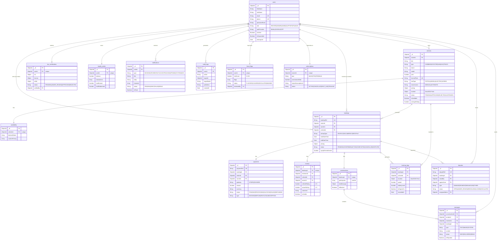

# Entity Relationship Diagram — Vehicle Rental Marketplace

> All 16 MongoDB collections with relationships and cardinality.

```mermaid
erDiagram

    users {
        ObjectId _id PK
        String firstName
        String lastName
        String email UK
        String phone UK
        String passwordHash
        String role "RENTER|OWNER|ADMIN|SUPPORT|FINANCE"
        String authProvider "EMAIL|GOOGLE|OTP"
        Boolean isActive
        Boolean isSuspended
        Date lastLoginAt
    }

    vehicles {
        ObjectId _id PK
        ObjectId ownerId FK
        String title
        String type "CAR|BIKE|SCOOTER|VAN|SUV|TRUCK"
        String brand
        String model
        Number year
        String licensePlate UK
        String fuelType "PETROL|DIESEL|ELECTRIC|HYBRID"
        String transmission "MANUAL|AUTOMATIC"
        Object pricing
        Object location "GeoJSON Point"
        String status "PENDING|APPROVED|REJECTED|SUSPENDED"
        Boolean isAvailable
        Number averageRating
    }

    availability {
        ObjectId _id PK
        ObjectId vehicleId FK "unique"
        Array blockedDates
        Array customPricing
    }

    bookings {
        ObjectId _id PK
        String bookingRef UK
        ObjectId renterId FK
        ObjectId ownerId FK
        ObjectId vehicleId FK
        String pricingType "HOURLY|DAILY|WEEKLY|MONTHLY"
        Date startDateTime
        Date endDateTime
        Object pricing
        String status "PENDING|CONFIRMED|ACTIVE|COMPLETED|CANCELLED|DISPUTED"
        Number loyaltyPointsEarned
    }

    payments {
        ObjectId _id PK
        String paymentRef UK
        ObjectId bookingId FK
        ObjectId renterId FK
        ObjectId ownerId FK
        String gateway "STRIPE|PAYHERE"
        Number amount
        String currency
        String status "PENDING|PROCESSING|SUCCESS|FAILED|REFUNDED"
        String type "BOOKING|REFUND|PAYOUT|SUBSCRIPTION"
    }

    reviews {
        ObjectId _id PK
        ObjectId bookingId FK "unique"
        ObjectId reviewerId FK
        ObjectId vehicleId FK
        ObjectId ownerId FK
        Number vehicleRating "1-5"
        Number ownerRating "1-5"
        String comment
        Boolean isVisible
    }

    conversations {
        ObjectId _id PK
        ObjectId bookingId FK "unique"
        Array participants "userIds"
        Object lastMessage
        Boolean isBlocked
    }

    messages {
        ObjectId _id PK
        ObjectId conversationId FK
        ObjectId senderId FK
        ObjectId receiverId FK
        ObjectId bookingId FK
        String type "TEXT|IMAGE|SYSTEM"
        String content
        String status "SENT|DELIVERED|READ"
        Boolean isReported
    }

    tracking_logs {
        ObjectId _id PK
        ObjectId bookingId FK
        ObjectId vehicleId FK
        Object location "GeoJSON Point"
        Number speed
        Number batteryLevel
        Boolean isEngineOn
        Date recordedAt
    }

    kyc_verifications {
        ObjectId _id PK
        ObjectId userId FK "unique"
        Object nic
        Object license
        Object selfie
        String status "PENDING|UNDER_REVIEW|APPROVED|REJECTED"
        ObjectId verifiedBy FK
    }

    disputes {
        ObjectId _id PK
        String disputeRef UK
        ObjectId bookingId FK
        ObjectId raisedBy FK
        ObjectId againstUser FK
        String type "DAMAGE|PAYMENT|BEHAVIOUR|OTHER"
        String status "OPEN|UNDER_REVIEW|RESOLVED|CLOSED|ESCALATED"
        ObjectId assignedAdmin FK
    }

    loyalty_points {
        ObjectId _id PK
        ObjectId userId FK "unique"
        Number balance
        Array transactions
        Number totalEarned
        Number totalRedeemed
    }

    notifications {
        ObjectId _id PK
        ObjectId userId FK
        String type "BOOKING|PAYMENT|KYC|CHAT|TRACKING|PROMO|SYSTEM|SOS"
        String title
        String body
        Array channels
        String status "PENDING|SENT|FAILED|READ"
        Boolean isRead
    }

    audit_logs {
        ObjectId _id PK
        ObjectId userId FK
        String action
        ObjectId targetId
        String targetModel
        String ipAddress
        Date createdAt
    }

    fraud_flags {
        ObjectId _id PK
        ObjectId userId FK "unique"
        Number riskScore "0-100"
        Array flags
        String status "FLAGGED|CLEARED|ESCALATED|BANNED"
        ObjectId reviewedBy FK
    }

    subscriptions {
        ObjectId _id PK
        ObjectId ownerId FK "unique"
        String plan "BASIC|PRO|PREMIUM"
        Number commissionRate
        String stripeSubscriptionId
        String status "ACTIVE|CANCELLED|PAST_DUE|TRIALING"
    }

    %% ─── Relationships ─────────────────────────────────────

    users ||--o{ vehicles : "owns"
    users ||--o{ bookings : "rents (as renter)"
    users ||--o{ bookings : "receives (as owner)"
    vehicles ||--|| availability : "has"
    vehicles ||--o{ bookings : "is booked"
    bookings ||--o| payments : "has"
    bookings ||--o| reviews : "has"
    bookings ||--|| conversations : "has"
    conversations ||--o{ messages : "contains"
    users ||--o{ messages : "sends"
    bookings ||--o{ tracking_logs : "generates"
    vehicles ||--o{ tracking_logs : "tracked in"
    users ||--|| kyc_verifications : "submits"
    bookings ||--o{ disputes : "may have"
    users ||--o{ disputes : "raises"
    users ||--|| loyalty_points : "earns"
    users ||--o{ notifications : "receives"
    users ||--o{ audit_logs : "generates"
    users ||--|| fraud_flags : "may have"
    users ||--|| subscriptions : "subscribes to"
```
